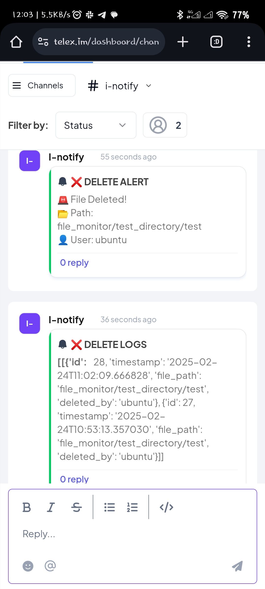

# File Deletion Monitor

## Overview
This project monitors file deletions in a specified directory using `auditd`, logs events to a PostgreSQL database, and sends alerts via a Telex Webhook.

## Features
- Monitors file deletions in a specified directory.
- Logs deleted files to a PostgreSQL database.
- Sends alerts to a Telex Webhook.
- Uses `auditd` for real-time monitoring.
- Runs in a virtual environment.
- Can be configured as a systemd service to run in the background.

## Installation

### 1. Clone the Repository
```sh
git clone <repository-url>
cd <repository-folder>
```

### 2. Create and Activate a Virtual Environment
```sh
python3 -m venv venv
source venv/bin/activate  # On macOS/Linux
venv\Scripts\activate  # On Windows
```

### 3. Install Dependencies
Ensure you have Python installed. Then, install the required dependencies:
```sh
pip install -r requirements.txt
```

### 4. Set Up Environment Variables
Create a `.env` file in the project root with the following content:
```
WATCHED_FOLDER=/home/ubuntu/test_directory
TELEX_WEBHOOK_URL=http://127.0.0.1:5000/telex-webhook
DB_NAME=file_monitor
DB_USER=postgres
DB_PASSWORD=yourpassword
DB_HOST=localhost
DB_PORT=5432
```
Replace the values as needed.
OR
```mv .sampleenv .env```
Using the sample database and telex channel link

### 5. Set Up PostgreSQL Database
Ensure PostgreSQL is running and create the necessary table:
```sh
psql -U postgres -d file_monitor -c "CREATE TABLE IF NOT EXISTS file_deletions (id SERIAL PRIMARY KEY, timestamp TIMESTAMP DEFAULT CURRENT_TIMESTAMP, file_path TEXT NOT NULL, deleted_by TEXT NOT NULL);"
```

### 6. Run the Monitor
Start the script using:
```sh
sudo python file_monitor.py
```
OR
Start the script using:
```sh
sudo venv/bin/python3 file_monitor.py
```
### 7. Testing the Integration
Start the script using:
```sh
./curl-test-telex
```

The script will continuously monitor for file deletions and log them.

## Running as a systemd Service
To keep the script running in the background, you can set it up as a systemd service.

### 1. Create a systemd Service File
Create a new file `/etc/systemd/system/file_monitor.service` and add the following content:
```
[Unit]
Description=File Deletion Monitor
After=network.target

[Service]
User=ubuntu
Group=ubuntu
WorkingDirectory=/home/ubuntu/<repository-folder>
ExecStart=/home/ubuntu/<repository-folder>/venv/bin/python /home/ubuntu/<repository-folder>/file_monitor.py
Restart=always

[Install]
WantedBy=multi-user.target
```
Replace `<repository-folder>` with the actual folder name.

### 2. Reload systemd and Enable the Service
```sh
sudo systemctl daemon-reload
sudo systemctl enable file_monitor.service
sudo systemctl start file_monitor.service
```

### 3. Check Service Status
```sh
sudo systemctl status file_monitor.service
```

## Troubleshooting
- Ensure `auditd` is installed and running:
  ```sh
  sudo apt install auditd
  sudo systemctl start auditd
  ```
- Check if the rule is set:
  ```sh
  auditctl -l
  ```
- Manually trigger an event to test:
  ```sh
  rm /home/ubuntu/test_directory/testfile.txt
  ```

## License
MIT License

